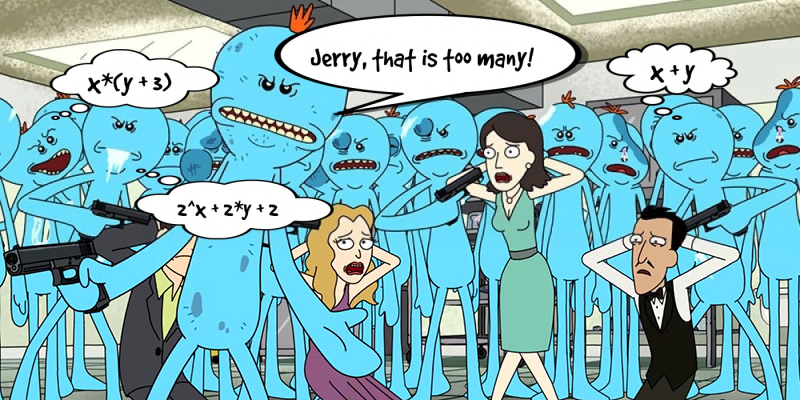

# Jerrify
Set of solutions for a task on Joker conf'18.

## Original task

Meeseeks is a function with two parameters: x and y. Meeseeks is quite simple and works only with **natural** numbers. And the result is **strictly increasing** by each parameter. Jerry invents a number and tries to find out how many options to get it meeseeks knows. But frequent appeal is a real pain for meeseeks. And the simple enumeration of all pairs (x, y) makes him suffer. Help Jerry solve the problem as humanely as possible.
